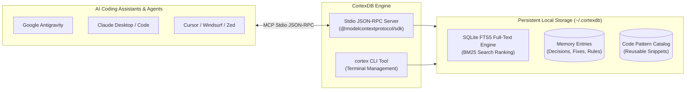

<div align="center">

# CortexDB
### Persistent Memory & Knowledge Engine for AI Coding Assistants (MCP)

[](LICENSE)
[](https://modelcontextprotocol.io)
[](https://www.sqlite.org/fts5.html)
[](https://www.typescriptlang.org/)
[](https://nodejs.org/)

<p align="center">
  A lightweight, high-performance persistent memory and knowledge engine designed for Model Context Protocol (MCP) compliant AI coding assistants and autonomous agents.
</p>

[Core Features](#core-features) • [Architecture](#architecture) • [Terminal CLI](#terminal-cli) • [Quick Start](#quick-start) • [MCP Tools](#mcp-tools) • [Agent Protocol](#agent-protocol)

</div>

---

**CortexDB** is engineered for AI coding assistants and autonomous developer agents (such as Google Antigravity, Claude Code, Claude Desktop, Cursor, Windsurf, Zed, and others). 

Powered by **SQLite** with memory-mapped I/O (`mmap_size`) and **native SQLite FTS5 BM25 full-text search**, CortexDB provides persistent context across coding sessions and bridges knowledge between independent project repositories without requiring external database services or cloud dependencies.

---

<a id="core-features"></a>
## ⚡ Core Features

- **Millisecond Search Speed:** Uses native SQLite FTS5 with BM25 ranking to perform fast full-text searches across past decisions, solutions, and code patterns, backed by SQLite memory caching and virtual page mapping.
- **Cross-Project Knowledge Sharing:** Retains solutions and architectural decisions across different workspaces. When a bug or design challenge is solved in *Project A*, an agent working in *Project B* can query and apply the solution via global search.
- **Automatic Project Context Detection:** Automatically identifies the active workspace using standard environment variables (`WORKSPACE_DIR`, `INIT_CWD`, `PROJECT_CWD`) with a fallback to `process.cwd()`, or through explicit parameters passed by the assistant.
- **Central Code Pattern Library:** A shared catalog where proven code patterns, reusable templates, and utility snippets can be stored and retrieved by name or description across any project.
- **In-Place Memory Editing & Purging:** Allows agents to update existing memory records in-place using their record ID, or permanently delete outdated decisions and patterns from both SQLite storage and search indexes.
- **Command-Line Interface (`cortex`):** Includes a standalone CLI tool for developers to inspect stored memories, view code patterns, run searches, and manage projects directly from the terminal.
- **Database Optimization & Maintenance:** Built-in routines for database maintenance (`VACUUM`, `ANALYZE`, and WAL checkpointing) to reclaim disk space and maintain indexing performance.

---

<a id="architecture"></a>
## 🏛️ Architecture

CortexDB operates locally on your workstation, communicating with AI coding agents via standard Model Context Protocol (MCP) JSON-RPC streams while serving human developers via the `cortex` terminal CLI.



---

<a id="terminal-cli"></a>
## 💻 Terminal CLI (`cortex`)

In addition to serving AI assistants over standard Stdio JSON-RPC, CortexDB includes a command-line administrator utility named **`cortex`**. Once linked or installed globally (`npm link` or `npm i -g .`), you can manage your stored data directly from PowerShell, Bash, or Command Prompt:

| CLI Command Syntax | Description & Purpose |
| :--- | :--- |
| **`cortex projects`** | Lists all tracked workspaces, directory paths, tech stacks, and total recorded memories per project. |
| **`cortex memories [project-name \| GLOBAL]`** | Displays detailed architectural decisions, bugfixes, and guidelines for a target workspace or global rules. |
| **`cortex patterns [query]`** | Lists stored code templates and snippet previews. |
| **`cortex search <query>`** | Executes SQLite FTS5 full-text search across all repositories right from your terminal. |
| **`cortex history [limit]`** | Displays chronological audit log history of memory creation, updates, deletions, and maintenance operations. |
| **`cortex rename-project <target> <name>`** | Renames a tracked workspace project and updates directory paths. |
| **`cortex delete-project <name-or-id>`** | Permanently deletes a tracked repository and its associated memory entries via SQLite cascade deletion. |
| **`cortex delete-record <type> <id>`** | Deletes a specific decision (`type: memory`) or snippet (`type: pattern`) from storage and search indexes using its numeric ID. |
| **`cortex optimize`** | Manually triggers storage optimization (`VACUUM`, `ANALYZE`, and WAL checkpoint truncate). |
| **`cortex help`** | Displays the terminal helper guide and command syntax. |

---

<a id="quick-start"></a>
## 🚀 Quick Start & Installation

### 1. Clone & Build
```bash
git clone https://github.com/your-username/cortexdb.git
cd cortexdb
npm install
npm run build

# Optional: Link globally to use the 'cortex' CLI command from any terminal
npm link
```

### 2. Connect to Your AI Coding Assistant

CortexDB communicates over standard input/output (stdio) using JSON-RPC via the Model Context Protocol (MCP). It can be integrated into any MCP-compatible environment. Below are configuration examples for common clients:

#### Example A: Google Antigravity Configuration (`mcp_config.json`)
Add the following configuration block to your Antigravity MCP settings:

```json
{
  "mcpServers": {
    "cortexdb": {
      "command": "node",
      "args": ["/absolute/path/to/cortexdb/build/index.js"]
    }
  }
}
```
*(On Windows, use forward slashes or escaped backslashes, e.g., `"C:/Projects/cortexdb/build/index.js"`)*

#### Example B: Claude Desktop & Claude Code Configuration (`claude_desktop_config.json`)
Add the configuration block into your Claude setup (`%APPDATA%\Claude\claude_desktop_config.json` on Windows or `~/.config/Claude/claude_desktop_config.json` on macOS/Linux):

```json
{
  "mcpServers": {
    "cortexdb": {
      "command": "node",
      "args": ["/absolute/path/to/cortexdb/build/index.js"]
    }
  }
}
```

> [!TIP]
> **Universal MCP Support:** Other MCP-compatible clients (e.g., Cursor, Windsurf, Zed) can be configured identically by directing their MCP server settings to `node` and the absolute path of `build/index.js`.

---

<a id="mcp-tools"></a>
## 🛠️ Available MCP Tools

CortexDB exposes 7 tools to MCP-enabled assistants:

| Tool Name | Purpose |
| :--- | :--- |
| **`cortex_remember_decision`** | Records new architectural decisions, bug fixes, coding rules, or lessons learned. Can also update existing entries in-place if an optional `id` parameter is supplied. Can be scoped to the local `PROJECT` or applied across all workspaces as a `GLOBAL` rule. |
| **`cortex_search_knowledge`** | Fast full-text search across past project decisions, bug solutions, and guidelines powered by SQLite FTS5. Supports `CURRENT`, `GLOBAL`, or `ALL` project scopes. |
| **`cortex_store_pattern`** | Saves or updates reusable code templates and snippets in the central cross-project pattern library. |
| **`cortex_get_pattern`** | Retrieves stored code snippets by name or functional description from the shared library. |
| **`cortex_get_project_summary`** | Generates a concise snapshot of the current repository, outlining its tech stack, recent design decisions, and mandatory global rules. |
| **`cortex_delete_record`** | Permanently deletes outdated decision records and code patterns from SQLite storage and search indexes using their numeric database ID. |
| **`cortex_optimize_database`** | Executes database defragmentation (`VACUUM`), updates query planner statistics (`ANALYZE`), and checkpoints Write-Ahead Logs (`WAL`). |

---

<a id="agent-protocol"></a>
## 🤖 Recommended Agent Rules & Behavior Protocol

While modern AI coding assistants discover CortexDB tools automatically via MCP, providing explicit behavioral guidelines helps assistants utilize persistent memory effectively.

You can add the following guidelines to your assistant's workspace instructions (e.g., `AGENTS.md`, `.cursorrules`, `SKILL.md`, or system instructions):

```markdown
# CortexDB - Memory & Knowledge Protocol

When operating in this workspace, you have access to persistent memory via CortexDB:

### 1. Discovery & Context Retrieval
- **Project Orientation:** Before implementing complex features or fixing unfamiliar bugs, call `cortex_get_project_summary({ projectName: '<current-project>' })` to inspect the active tech stack and mandatory `GLOBAL` rules.
- **Cross-Project Knowledge Search:** When encountering tricky errors, environment issues, or integration bugs, query `cortex_search_knowledge({ query: '...', projectScope: 'ALL' })` to check if a verified solution was documented in past projects.
- **Pattern Reuse:** Before writing common boilerplate or utilities, check `cortex_get_pattern({ query: '...' })` to reuse approved templates.

### 2. Recording Knowledge & Patterns
- **Verified Solutions Only:** Always test and verify your code before saving. Once verified, store the breakthrough using `cortex_remember_decision`.
- **Choose Appropriate Type:** Use the appropriate category: `'bugfix'`, `'decision'`, `'rule'`, `'architecture'`, or `'lesson'`.
- **Scoping Discipline:**
  - Use `scope: 'PROJECT'` for workspace-specific logic, libraries, and design choices.
  - Use `scope: 'GLOBAL'` ONLY for universal engineering standards and conventions applicable across all projects.
- **Pattern Storage:** Save reusable, generic code snippets to the central library using `cortex_store_pattern`.

### 3. Memory Hygiene & Maintenance
- **In-Place Updates:** When refining an existing memory, pass its numeric ID: `cortex_remember_decision({ id: <id>, ... })` to update in-place without creating duplicate records.
- **Safe Purging:** To remove obsolete decisions or snippets, call `cortex_delete_record({ type: 'memory' | 'pattern', id: <id> })`.
- **Optimization:** If database operations feel slow after large updates, call `cortex_optimize_database()`.
```

---

## ⚙️ Configuration & Tuning

On startup, CortexDB creates a configuration file at **`~/.cortexdb/config.json`** and initializes the database at **`~/.cortexdb/global_memory.db`**.

Performance and storage limits can be adjusted directly in `~/.cortexdb/config.json`:

```json
{
  "dbPath": "~/.cortexdb/global_memory.db",
  "pragma": {
    "journalMode": "WAL",
    "synchronous": "NORMAL",
    "cacheSize": -524288,
    "mmapSize": 8589934592,
    "tempStore": "MEMORY"
  },
  "limits": {
    "maxTitleLength": 1000,
    "maxContentLength": 500000,
    "maxPatternSnippetLength": 500000,
    "maxPatternDescriptionLength": 25000,
    "maxTagsLength": 5000,
    "maxNameLength": 300,
    "maxSearchQueryLength": 1000
  },
  "logLevel": "info"
}
```
*(The sample configuration above sets a 512 MB SQLite cache, an 8 GB memory-mapped I/O limit, and generous limits for storing large code templates).*

---

## 🧪 Developer Commands & Testing

```bash
# Compile TypeScript source to build directory
npm run build

# Run unit tests (PRAGMAs, SQLite FTS5 search benchmarks, cascade deletion, and tool tests)
npm run test

# Run interactive cross-project AI agent simulation in terminal
npm run simulate

# Execute CLI utility
npm run cortex -- help
npm run cortex -- projects

# Execute database optimization (VACUUM & ANALYZE)
npm run optimize
```

---

## 📄 License

Licensed under the **Apache License 2.0**. See the [LICENSE](LICENSE) file for details.
